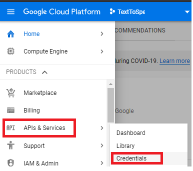
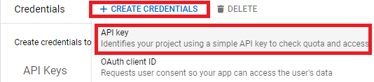
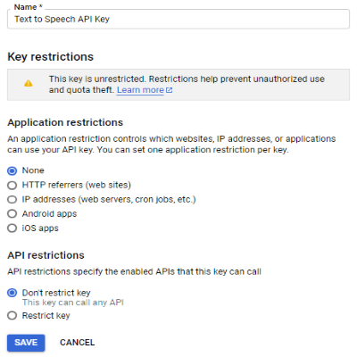
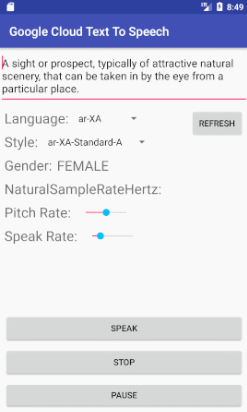

# Google Cloud Platform TTS use API-KEY on Android.

## How to use it?

### Step 1: Download file 
```
git clone https://github.com/changemyminds/Google-Cloud-TTS-Android.git
```
### Step 2: Set up API Key
Go to [here](app/build.gradle) and change "YOUR_API_KEY" to your Google Cloud API Key. 
```
debug{
    buildConfigField "String", "API_KEY", "\"YOUR_API_KEY\""
}
```

p.s If you want test your API key by JUnit, go to [here](googlecloudtts/build.gradle) and change "YOUR_API_KEY" to test.

__Note__ <br>
If you don't know the Google API Key, please see [Google document](https://cloud.google.com/docs/authentication/api-keys). <br>

Here prompt the Google API KEY setting. <br>
(1) Got to [google console cloud dashboard](https://console.cloud.google.com/home/dashboard)<br>
(2) Click upper left corner menu and select 'APIs & Services' choose the Credentials.<br>
<br>
(3) Add CREATE CREDENTIALS and select API Key that will create the no restrict key.<br>
<br>
(4) Don't forget your API-Key Application restrictions and API restrictions must select _None_ and _Don't restrict key_.<br>
<br>
 
### Step 3: Run app<br>
<br>

## Google-Cloud-TTS-Android libs
### How to install it ?
Step 1. Add the JitPack repository in your root build.gradle
```
buildscript {
    ...
}

allprojects {
	repositories {
		...
		maven { url 'https://jitpack.io' }
	}
}
```
Step 2. Add the dependency in your app build.gradle
```
android {
    ...
}

dependencies {
    implementation 'com.github.changemyminds:Google-Cloud-TTS-Android:1.0.2'
}
```

### How to use it ?
See the below sample.
```
// Set the ApiKey and create GoogleCloudTTS.
GoogleCloudTTS googleCloudTTS = GoogleCloudTTSFactory.create("YOUR_API_KEY");

// Load google cloud VoicesList and select the languageCode and voiceName with index (0 ~ N).
VoicesList voicesList = googleCloudTTS.load();
String languageCode = voicesList.getLanguageCodes()[0];
String voiceName = voicesList.getVoiceNames(languageCode)[0];

// Set languageCode and voiceName, Rate and pitch parameter.
googleCloudTTS.setVoiceSelectionParams(new VoiceSelectionParams(languageCode, voiceName))
    .setAudioConfig(new AudioConfig(AudioEncoding.MP3, 0.35f , 10f));
    
// start speak
googleCloudTTS.start("you want speak something");

// stop speak
googleCloudTTS.stop();

// pause speak
googleCloudTTS.pause();

// resume speak
googleCloudTTS.resume();
```

## Support Language
### Test language and voice
If you want to test voice or find support language, you can go [here](https://cloud.google.com/text-to-speech/) to test online.

## Reference
[Google Cloud Java Issue](https://github.com/googleapis/google-cloud-java/issues/3400)<br>
[Google Cloud Text-to-speech](https://cloud.google.com/text-to-speech/docs/)<br>
[OkHttp](http://square.github.io/okhttp/)<br>
[Gson](https://github.com/google/gson)

